# 3D Printer Setup

This is some information about my 3d printing setup, and some knowledge I accumulated on the way.

## Ender 3 Pro (with benefits)

I started with an [Ender 3 Pro](https://www.creality3d.shop/products/creality3d-ender-3-pro-high-precision-3d-printer) that I got from [Banggood](https://www.banggood.com/Creality-3D-Customized-Version-Ender-3X-Pro-or-Ender-3Xs-Pro-Prusa-I3-3D-Printer-220x220x250mm-Printing-Size-With-Magnetic-Removable-Sticker-or-Glass-Plate-Platform-or-V1_1_5-Super-Silent-Mainboard-p-1535619.html) for relatively cheap (£220 shipped). This particular listing comes with the upgraded [Silent Mainboard V1.1.5](https://www.creality3dofficial.com/products/creality-silent-mainboard-v1-1-5) already preinstalled, making it an even better deal. They also throw in a glass bed and some clips, along with the soft magnetic bed every Ender 3 Pro comes with.

## Non-Printable Upgrades

It is well known in the community that the Ender 3 (and the Pro for that matter) suffer from some common issues that can be luckily fixed.

### Extruder Issues

The plastic extruder that comes stock on the Ender 3 seems to pose problems extruding at times. 
The solution is to upgrade to an aluminium extruder. I got mine from [Banggood](https://www.banggood.com/Aluminum-Block-Silver-Metal-Extruder-Kit-for-Creality-3D-Ender-33-Pro5CR-1010S-1_75mm-Filament-p-1577567.html) as well.

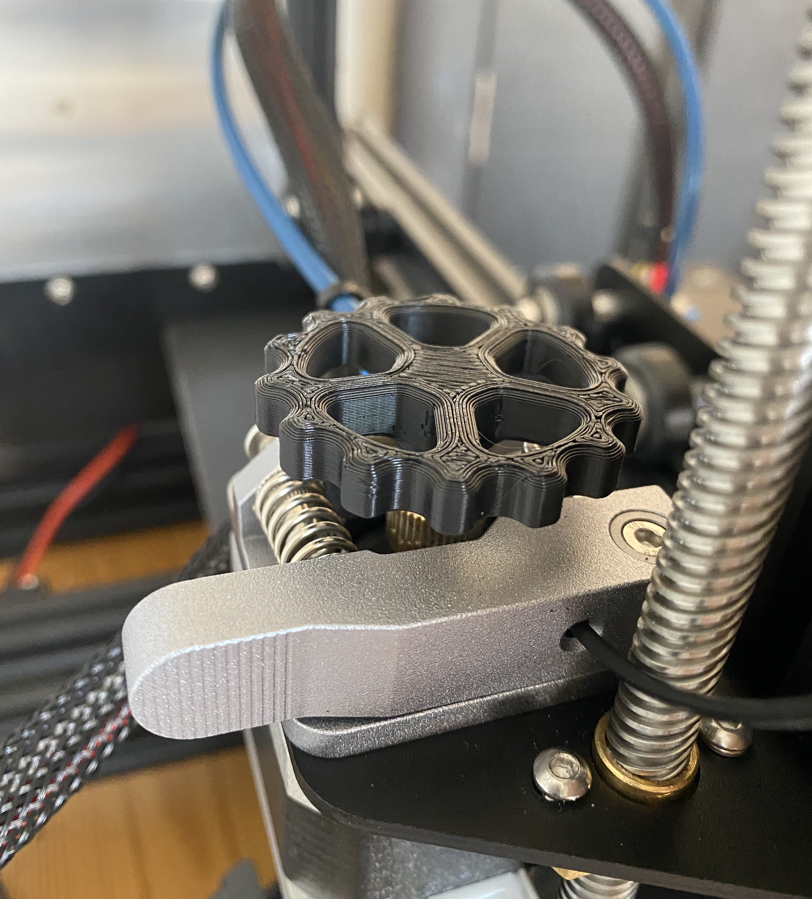

### PTFE Tube is loose

The stock PTFE tube between the extruder and the nozzle can get loose because of the couplings on both sides. Mine happened to come with clips to fix them in place. Also, the upgraded extruder has an upgraded *PC4-M10* coupling on it, so probably there is no need to replace that.

It seems that stock models of Ender 3 (Pro) come with a *PC4-M10* coupling on the hotend and a *PC4-M6* on the extruder end. The solution will be to replace those, and/or add some clips to hold them extended.

### PTFE Tube is not great

Apart from not being properly fixed on both sides, the PTFE tube that comes with the printer is not great in itself. Many people recommend the blue PTFE tubing kit from [Capricorn](https://www.captubes.com/shop/#!/XS-Creality-Kit-1-Meter/p/123266986/category=23214267). It has a smaller interior diameter, allowing for a smaller tolerance in the material slack. It might not be enough to let you print flexible materials on a Bowden system, but it is still a worthwhile upgrade. I got mine from [Amazon UK](https://www.amazon.co.uk/Sovol-Genuine-Capricorn-Filament-Pneumatic/dp/B085WJYL1J/).

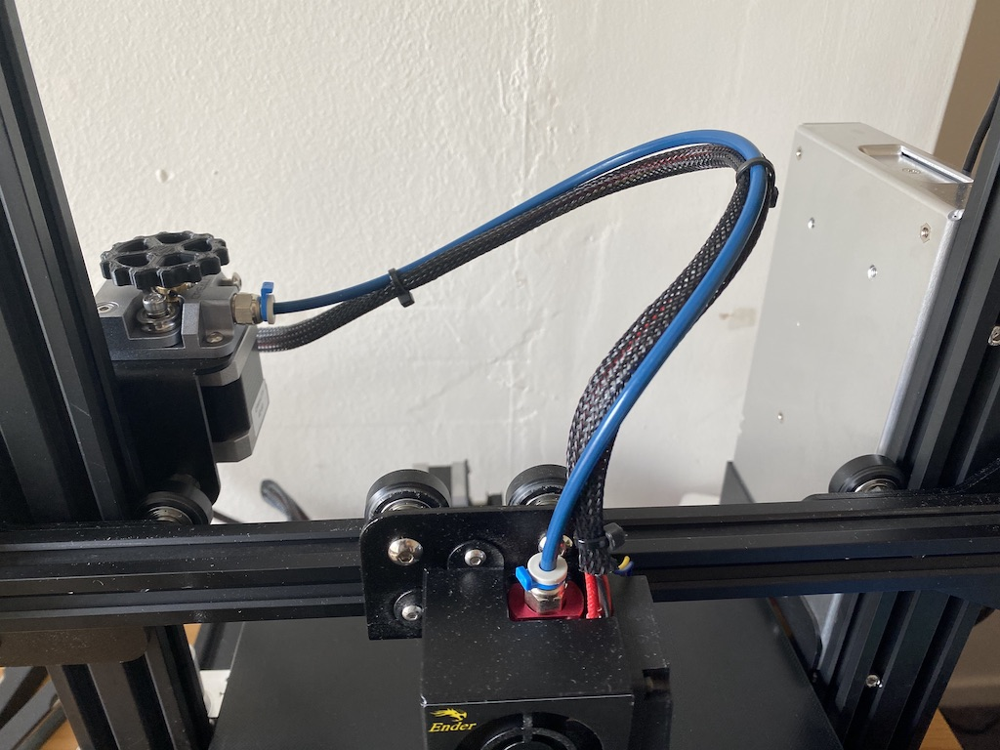

### Hotend temperature

Some people report the hotend falling behind when it comes to keeping up high temperatures. An easy solution is to add a silicone cover for the hotend. The printer I got from Banggood already came with one installed, but you can get one that covers the nozzle a little bit better from [Banggood](https://www.banggood.com/Creality-3D-Hotend-Heating-Block-Silicone-Cover-Case-For-3D-Printer-Part-p-1372492.html?rmmds=myorder&cur_warehouse=CN).

Really high temperatures are not really recommended with this type of hotend anyway since the PTFE tube is all the way inside it. For printing high temperature materials like ABS or NylonX, it is recommended that you upgrade to an all metal hotend like the Micro Swiss.

### Better springs

In terms of bed leveling, people recommend getting some better springs to keep the bed stiffer, which then requires less fiddling with the bed level over time. 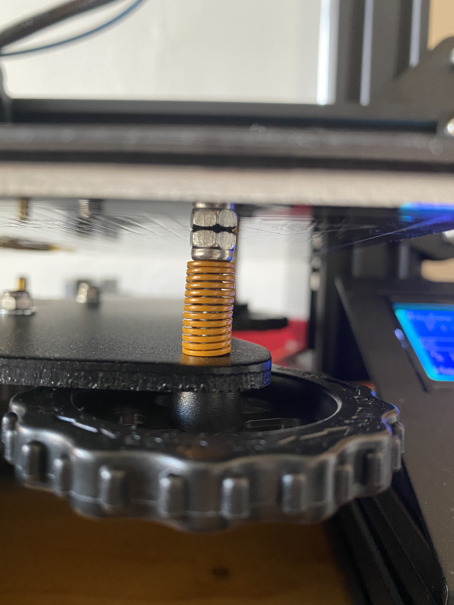. I also added *nyloc* nuts at the base of the bed screws, to keep them in place while the adjustment wheels are being turned. This will raise bed by 3-5mm, requiring the repositioning of the Z axis home switch, like so: 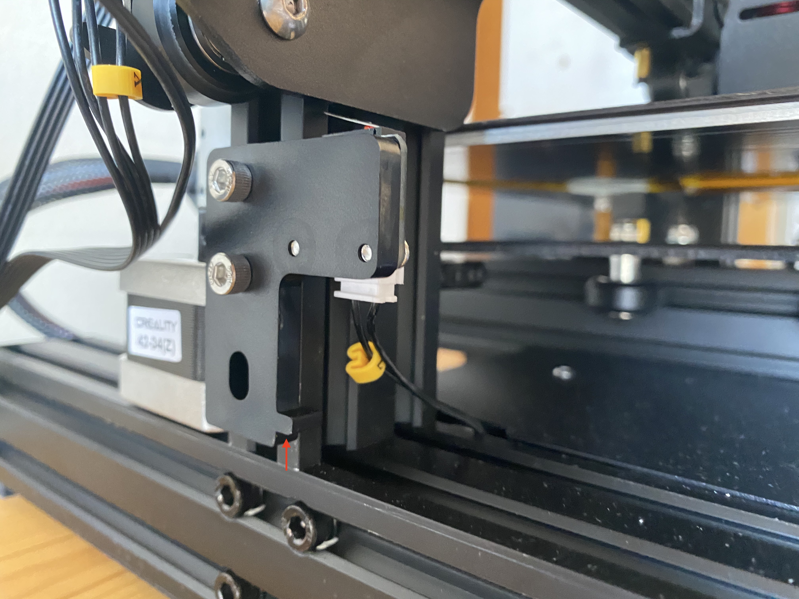

This is also the case when adding the glass bed that adds 5mm in itself: 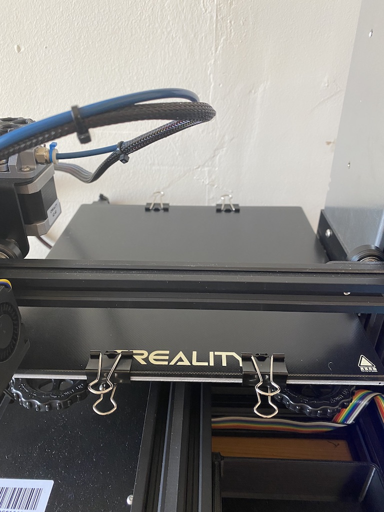

## Printable Upgrades

In terms of printable upgrades, there are a couple I highly recommend for a new Ender 3:

* [Z-axis motor spacer](https://www.thingiverse.com/thing:2752080), aligns the Z axis motor better so the movement is perfectly smooth. Must have! 
* [Upgraded nozzle fan duct](https://www.thingiverse.com/thing:3906045), allows much better cooling of parts at the nozzle. Another must have! 
* [Extruder knob](https://www.thingiverse.com/thing:3109769), allows manual movement of the extruder, and is a good visual cue that the extruder is moving. 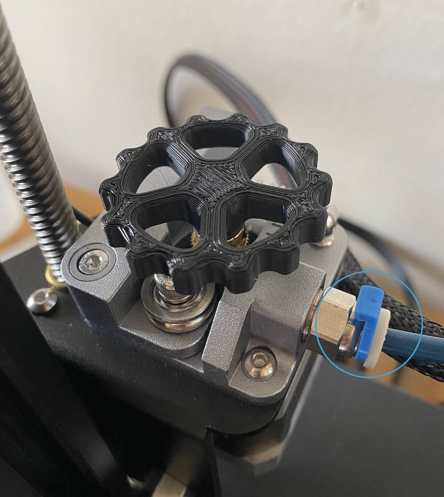
* [Filler - Filament roller](https://www.thingiverse.com/thing:3020026) is a great fillament roller that is modular and installs with all kinds of mounts. Note: You will need two standard skateboard bearings.
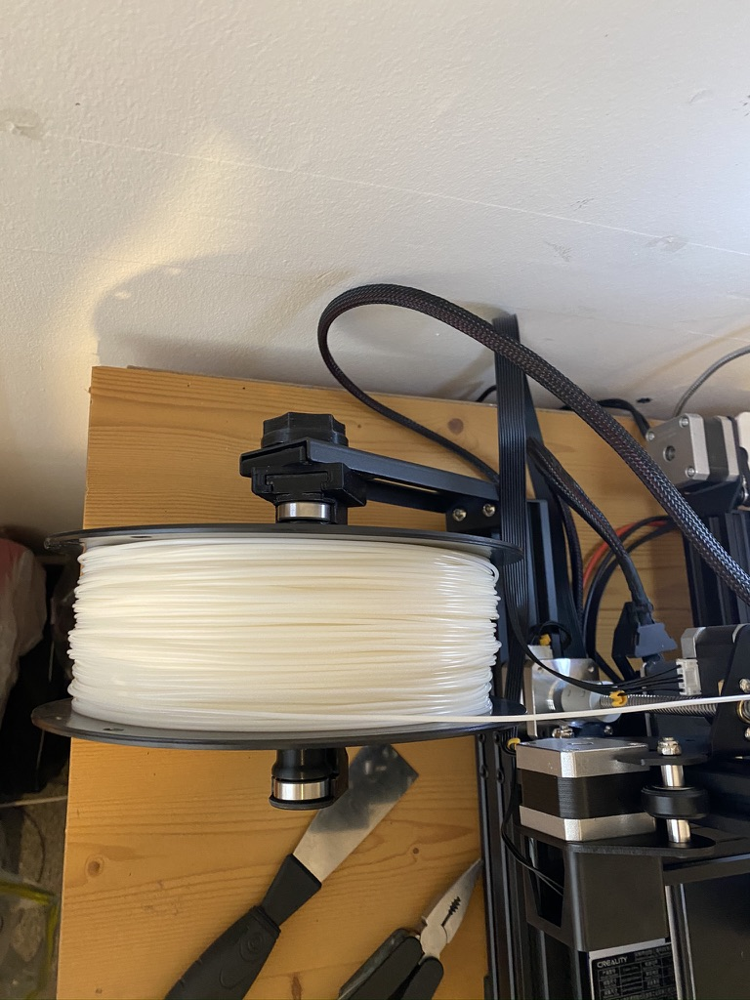
* [Cable Clips](https://www.thingiverse.com/thing:2880021) mount to the rails of the printer, keeping the display ribbon cable in place. Print 2-3 of those
* [Display cover](https://www.thingiverse.com/thing:2987100), great preventing touching the back of your screen
* [Front drawer](https://www.thingiverse.com/thing:3162464), you can place your tools in there. Note: Very long print.
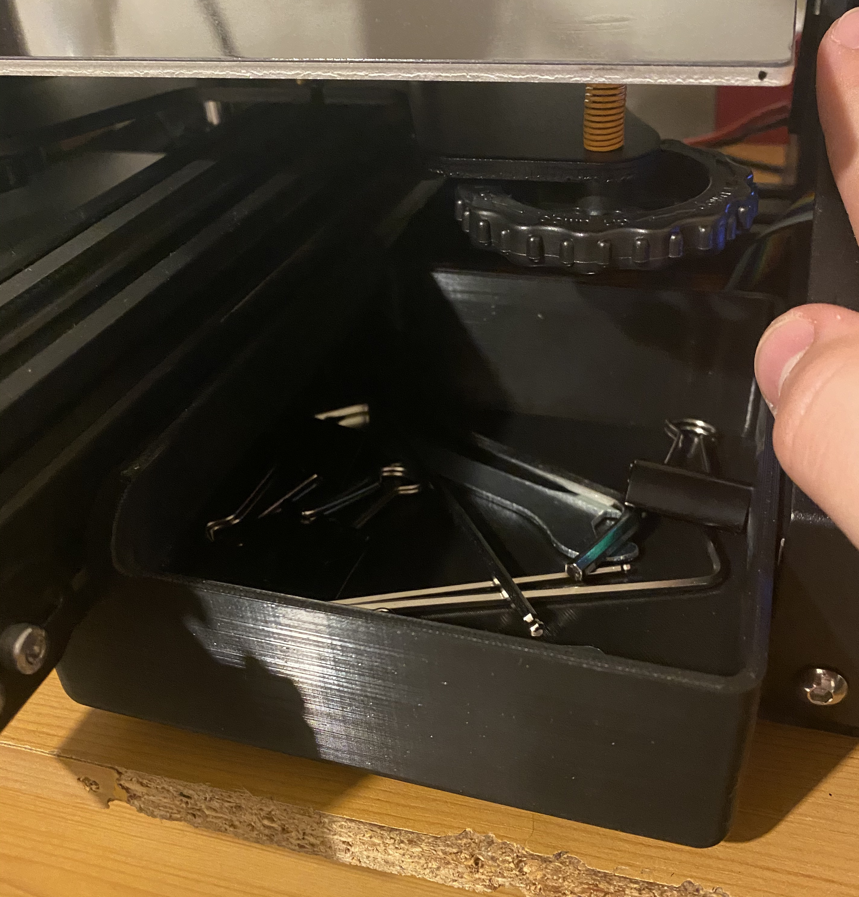
* [Coupling clips](https://www.thingiverse.com/thing:2994683), who said you need to buy those clips when you can print them! 

## Software

### Slicer

Nowadays, PrusaSlicer has Ender 3 compatibility, and the profile is pretty good. There are some things worth turning on, but I will leave this as an exercise for the reader :).
One thing I found useful is to add a 3d model of the [magnetic bed](bed-model/bed.stl), so that you have a visual reference in PrusaSlicer when you're manipulating prints:
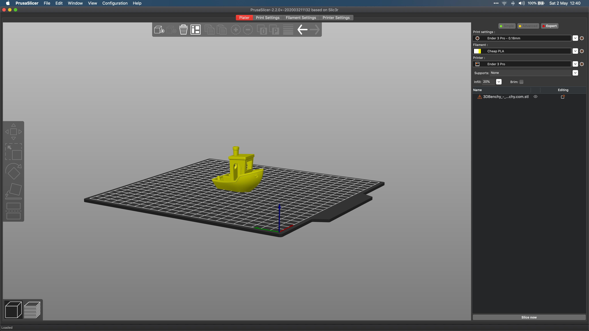

### Octoprint

Using Octoprint to control the printer is a great way to remotely control and monitor your long prints, not requiring you to be in the same room as the printer all the time! Just flash [Octoprint](https://octoprint.org) on a MicroSD card and pop it into a Raspberry Pi and you're good to go. Adding a USB webcam into the mix makes things even better:

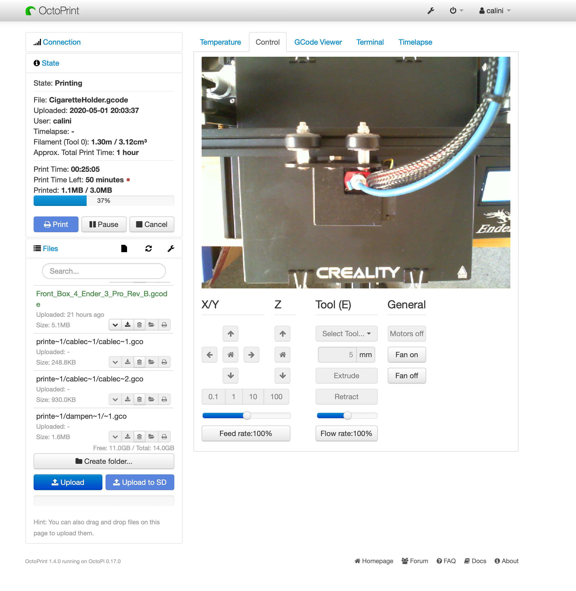

## Finally printing

After all of this configuration and fiddling, you might be wondering.. Where is the benchy?
Well, there it is, and apart from a bit of stringing which is common with Bowden systems (and can be mitigated somewhat with slicer settings), it looks great.

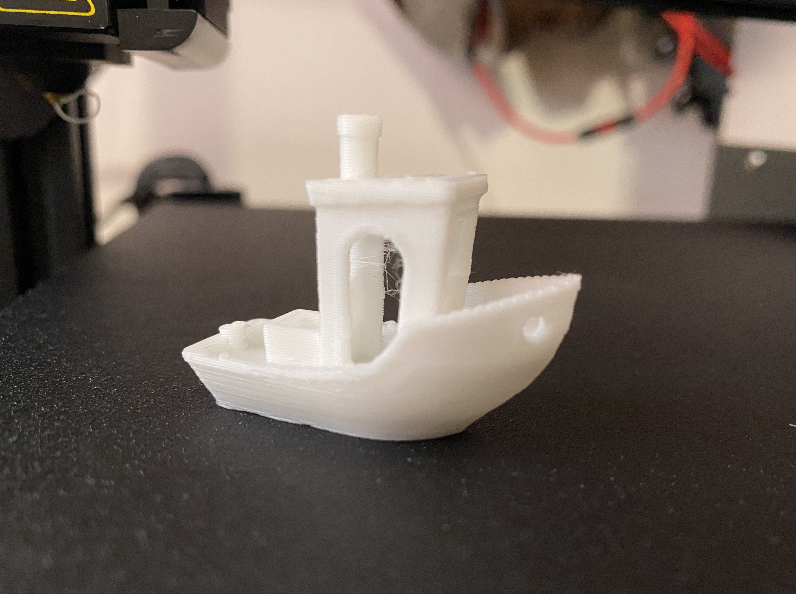

Also, check out how well this bust of Helios printed. Just perfect while listening to some [MACINTOSH PLUS](https://www.youtube.com/watch?v=bAgmGZ9iQ2Y).

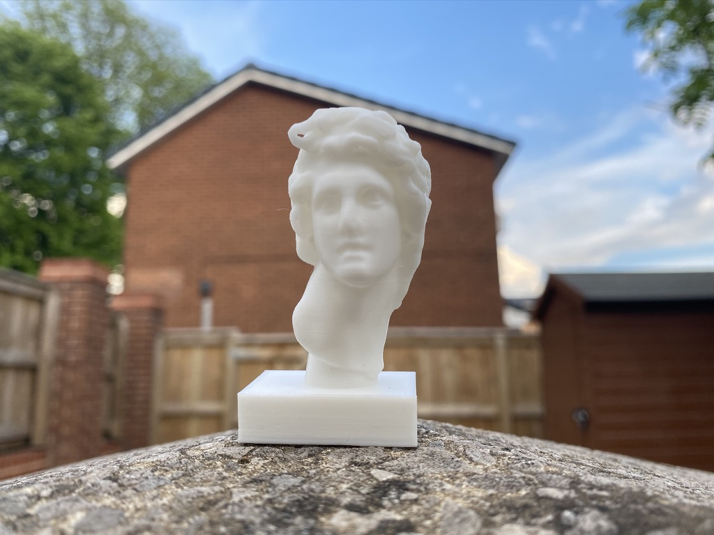
