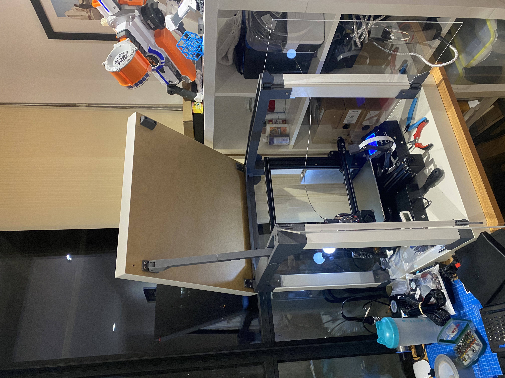
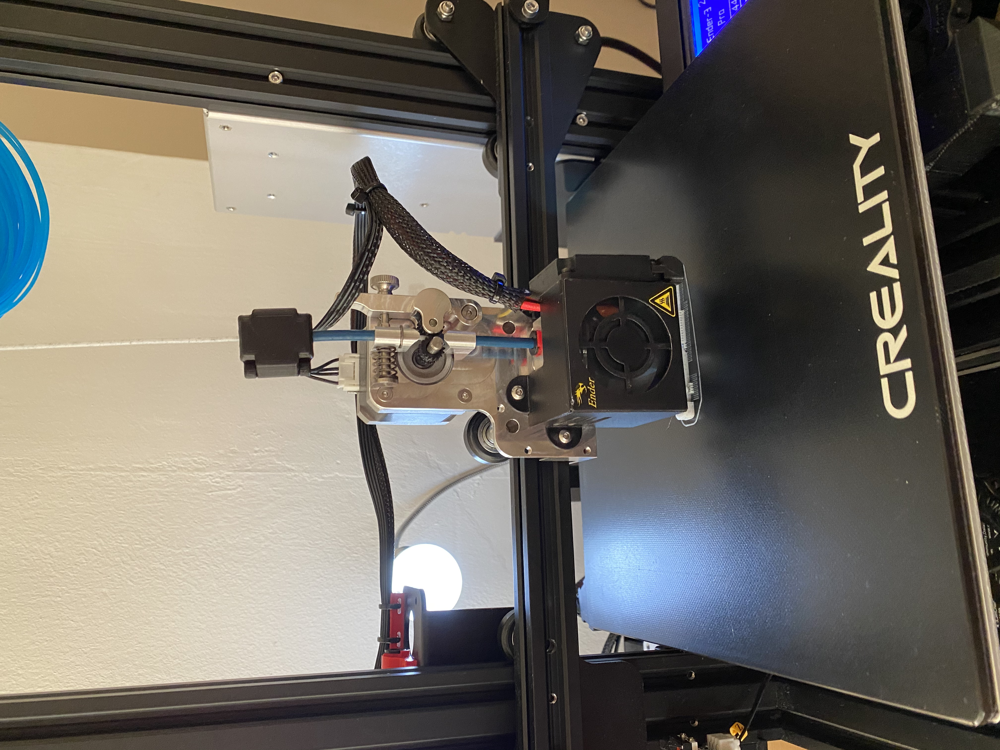
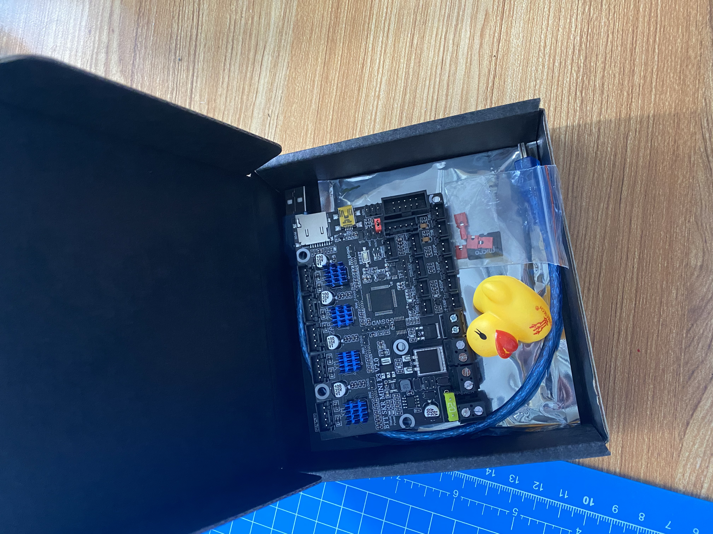
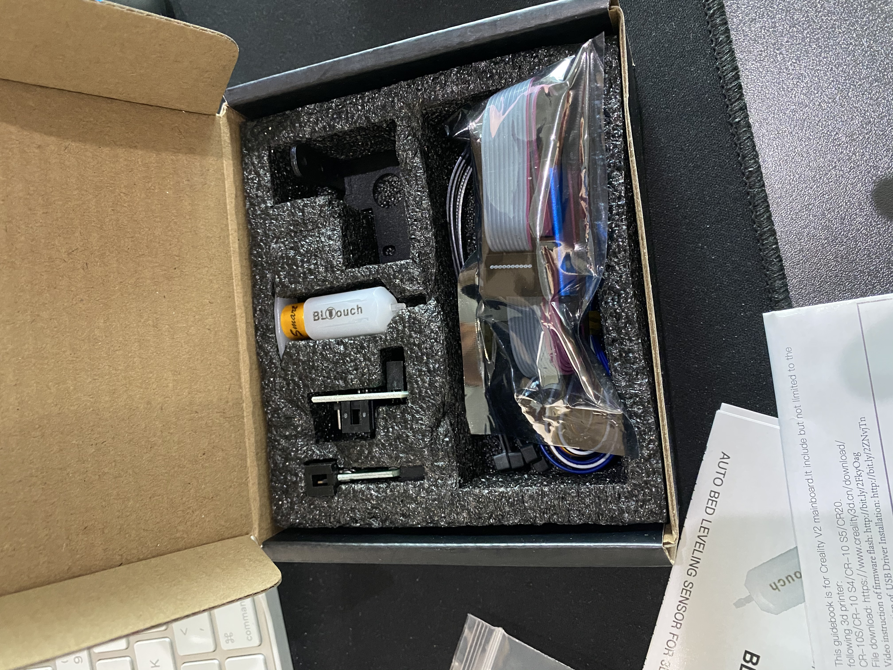
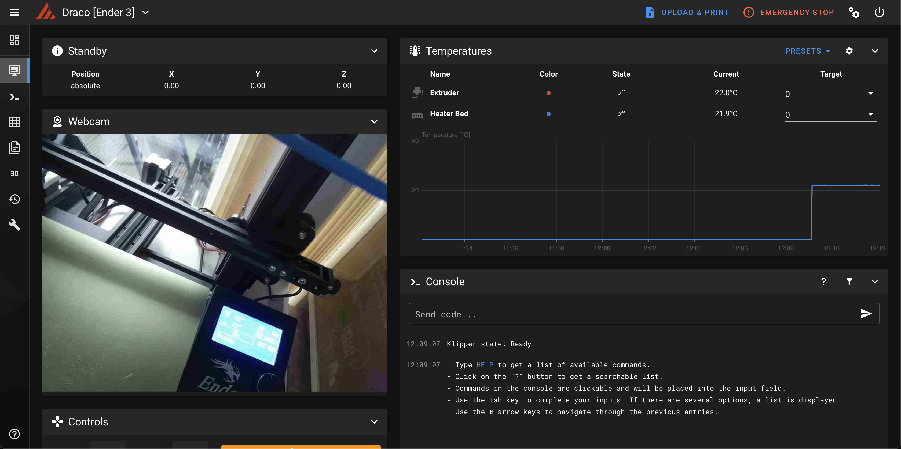
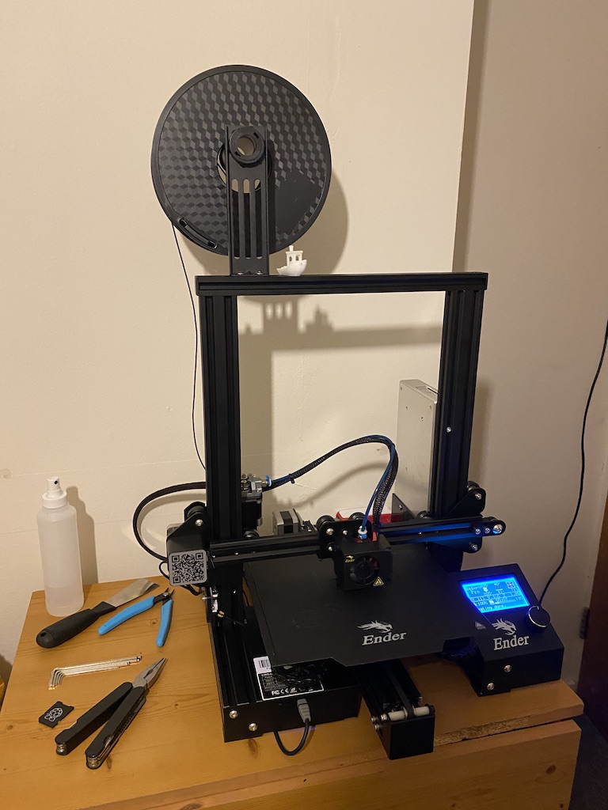

# Ender 3 Pro Setup

This is some information about my Ender 3 3D printer, and some knowledge I accumulated on the way.

## Ender 3 Pro (with benefits)

I started with an [Ender 3 Pro](https://www.creality3d.shop/products/creality3d-ender-3-pro-high-precision-3d-printer) that I got from [Banggood](https://www.banggood.com/Creality-3D-Customized-Version-Ender-3X-Pro-or-Ender-3Xs-Pro-Prusa-I3-3D-Printer-220x220x250mm-Printing-Size-With-Magnetic-Removable-Sticker-or-Glass-Plate-Platform-or-V1_1_5-Super-Silent-Mainboard-p-1535619.html) for relatively cheap (£220 shipped). This particular listing comes with the upgraded [Silent Mainboard V1.1.5](https://www.creality3dofficial.com/products/creality-silent-mainboard-v1-1-5) already preinstalled, making it an even better deal. They also throw in a glass bed and some clips, along with the soft magnetic bed every Ender 3 Pro comes with.

## Non-Printable Upgrades

It is well known in the community that the Ender 3 (and the Pro for that matter) suffer from some common issues that can be luckily fixed. While keeping true to the principle of being economical, I decided to invest a bit in some upgrades I consider worthwhile:

Product | Description | Price | Source | Date
  ---   |     ---     |  ---  |  ---   | ---
Ender 3 Pro | Ender 3 Pro + Upgraded Silent Motherboard v1.1.5 + Glass Bed | £220 | [Banggood.com](https://www.banggood.com/Creality-3D-Customized-Version-Ender-3Xs-Pro-3D-Printer-220x220x250mm-Printing-Size-With-Magnetic-Removable-Sticker-or-Glass-Plate-Platform-or-V1_1_5-Super-Silent-Mainboard-p-1535619.html?rmmds=myorder&ID=6285961&cur_warehouse=UK) | 2020.05.08
All Metal Extruder + Direct Drive | All Metal Extruder + Direct Drive Kit from MicroSwiss | £105 | [Amazon.co.uk](https://www.amazon.co.uk/gp/product/B084Q5FDKG) | 2020.05.16
SKR Mini E2 V2.0 | 32 Bit Board with  TMC2209s | £44 | [Amazon.co.uk](https://www.amazon.co.uk/gp/product/B0882QGFZR/) | 2020.10.19
BL Touch | BL Touch Auto Bed Levelling Sensor | £47 | [Amazon.co.uk](https://www.amazon.co.uk/gp/product/B087PPFNNP/) | 2020.10.19
Bed springs | Upgraded bed springs and Nylock nuts | £10 | [Amazon.co.uk](https://www.amazon.co.uk/gp/product/B083J92GB5) | 2020.05.15
Belts | Ruthex GT2 Belts | £10 | [Amazon.co.uk](https://www.amazon.co.uk/gp/product/B07ZPGLF2X) | 2020.08.01
Belt tensioners | X, Y axis belt tensioners | £30 | [eBay.co.uk](https://www.ebay.co.uk/itm/3D-Printer-2020-2040-X-axis-Timing-Belt-Stretch-Tensioner-or-Ender-3-CR-10-A0J3/184507236737?hash=item2af57d0181:g:EosAAOSw33tfDX3-) | 2020.07.15
Swiss Clips | Better clips for glass bed | £3 | [eBay.co.uk](https://www.ebay.co.uk/itm/SWISS-A-CLIPS-FRAMELESS-PICTURE-FRAME-MOUNTS-7-5mm-FIXING-GLASS-FRAMLESS-CLIP/202922134770?ssPageName=STRK%3AMEBIDX%3AIT&var=503097780379&_trksid=p2057872.m2749.l2649) | 2020.10.29
Spring Steel Bed | Spring Steel Bed with PEI sheet | £28 | [Amazon.co.uk](https://www.amazon.co.uk/gp/product/B082PFL8TX/) | 2020.10.29
Bearings | 608ZZ (skateboard) bearings for the [upgraded filament holder](https://www.thingiverse.com/thing:3020026) | £7 | [Amazon.co.uk](https://www.amazon.co.uk/gp/product/B01N1MX8R0) | 2020.05.12

## Unused Upgrades

Product | Description | Price | Source | Date
  ---   |     ---     |  ---  |  ---   | ---
Extruder | Aluminium Creality Bowden Extruder | £12 | [banggood.com](https://www.banggood.com/Aluminum-Block-Silver-Metal-Extruder-Kit-for-Creality-3D-Ender-33-Pro5CR-1010S-1_75mm-Filament-p-1577567.html?rmmds=myorder&cur_warehouse=UK) | 2020.04.08
Nozzle | 0.4mm MicroSwiss Nozzle | £20 | [3djake.uk](https://www.3djake.uk/micro-swiss/mk8-nozzle-hardened-steel?sai=3916) | 2020.04.25
Nozzle Set | 19x Nozzles 0.2-1.0mm | £4.5 | [eBay.co.uk](https://www.ebay.co.uk/itm/3D-Printer-Brass-Extruder-Nozzle-for-Creality-Ender-3-CR-10-MakerBot-Replicator/184382605832?hash=item2aee0f4a08:g:iPcAAOSwvC1fIygP) | 2020.04.25
Nozzle Wrench | Nozzle Wrench | £4 | [eBay.co.uk](https://www.ebay.co.uk/itm/3D-Printer-Nozzle-Wrench-Removal-Hexagonal-Tool-For-MK8-Brass-Steel-M2-5-M3-M4/223846849527?hash=item341e4fdbf7:g:Mb4AAOSwM~deGf-d) | 2020.05.03
Magnetic Bed Surface | Replacement Magnetic Bed Surface for Ender 3 | £12 | [eBay.co.uk](https://www.ebay.co.uk/itm/Upgrade-Magnetic-Plate-Heated-Bed-Build-Surface-Pad-Board-For-Ender-3-3D-Printer/392840432872?epid=14037967125&hash=item5b771d4ce8:g:gZ4AAOSwiFhe6IWr) | 2020.04.29
Couplings | 10x PTFE Tube connectors (PC4-M10) | £8 | [Amazon.co.uk](https://www.amazon.co.uk/10-Pack-Straight-Connector-pc4-m10-Connector-extruder/dp/B07BPVKT48/ref=sr_1_3?dchild=1&keywords=pc4-m10&qid=1604791058&sr=8-3) | 2020.05.14
Replacement Rollers | Plastic Wheels for Z gantry | £14 | [Amazon.co.uk](https://www.amazon.co.uk/gp/product/B07Q5WN3GK) | 2020.05.10
Capricorn Tube | PTFE Tube with cutter | £20 | [Amazon.co.uk](https://www.amazon.co.uk/Creality-Capricorn-Bowden-Filament-Printer/dp/B07XXRVGP9/ref=sr_1_7?crid=3NUY4II7KRVB4&dchild=1&keywords=capricorn+ptfe+tube+for+1.75mm&qid=1604791074&s=industrial&sprefix=capricorn+%2Caps%2C156&sr=1-7) | 2020.05.12
Lubricant | Dry PTFE Lubricant from WD-40 (for Z rod) | £8 | Amazon.co.uk | 2020.05.10

## Materials and Consumables

Brand | Model | Material | Price/kg | Spool size | Source | Date | Grade | Notes
  ---  |  ---  |  ---  |  ---  |  ---  |  ---  |  ---  |  --- | ---
Fiberlogy |  Orange TPE/TPU (Fiberflex 30D)  | TPU | £37 | 850g | [3djake.uk](https://www.3djake.uk/fiberlogy/fiberflex-30d-orange?sai=4711) | 2020.10.05 | ✅ | Great so far
Geeetech |  Marble PLA  | PLA | £24 |  1KG | [Amazon.co.uk](https://www.amazon.co.uk/Geeetech-Marble-Filament-Printer-Printers/dp/B0755BNZR5/ref=sr_1_3?dchild=1&keywords=geeetech+marble&qid=1604790618&s=industrial&sr=1-3) | 2020.05.10 | ✅ | Great, especially for the price!
Prusament |  Multiple colors PLA  | PLA | £28 |  1KG | [Prusament.com](https://prusament.com) | 2020.05.10 | ✅ | Great, as expected!
Fillamentum | Multiple colors PLA | PLA | £25 | 0.75KG | [3djake.uk](https://www.3djake.uk/search?keyword=Fillamentum+PLA) | 2021.01.01| ✅ | Many colors to choose from, smaller size
Fillamentum | Multiple colors ASA | ASA | £31 | 0.75KG | [3djake.uk](https://www.3djake.uk/search?keyword=Fillamentum+ASA) | 2021.01.01| ✅ | Many colors to choose from, smaller size

### Better springs

In terms of bed leveling, people recommend getting some better springs to keep the bed stiffer, which then requires less fiddling with the bed level over time. . I also added *nyloc* nuts at the base of the bed screws, to keep them in place while the adjustment wheels are being turned. This will raise bed by 3-5mm, requiring the repositioning of the Z axis home switch, like so: 

This is also the case when adding the glass bed that adds 5mm in itself: 

### PTFE Tube is loose

The stock PTFE tube between the extruder and the nozzle can get loose because of the couplings on both sides. Mine happened to come with clips to fix them in place. Also, the upgraded extruder has an upgraded *PC4-M10* coupling on it, so probably there is no need to replace that.

It seems that stock models of Ender 3 (Pro) come with a *PC4-M10* coupling on the hotend and a *PC4-M6* on the extruder end. The solution will be to replace those, and/or add some clips to hold them extended.

### PTFE Tube is not great

Apart from not being properly fixed on both sides, the PTFE tube that comes with the printer is not great in itself. Many people recommend the blue PTFE tubing kit from [Capricorn](https://www.captubes.com/shop/#!/XS-Creality-Kit-1-Meter/p/123266986/category=23214267). It has a smaller interior diameter, allowing for a smaller tolerance in the material slack. It might not be enough to let you print flexible materials on a Bowden system, but it is still a worthwhile upgrade. I got mine from [Amazon UK](https://www.amazon.co.uk/Sovol-Genuine-Capricorn-Filament-Pneumatic/dp/B085WJYL1J/).

### Extruder Issues

The plastic extruder that comes stock on the Ender 3 seems to pose problems extruding at times. 
The solution is to upgrade to an aluminium extruder. I got mine from [Banggood](https://www.banggood.com/Aluminum-Block-Silver-Metal-Extruder-Kit-for-Creality-3D-Ender-33-Pro5CR-1010S-1_75mm-Filament-p-1577567.html) as well.

### Hotend temperature

Some people report the hotend falling behind when it comes to keeping up high temperatures. An easy solution is to add a silicone cover for the hotend. The printer I got from Banggood already came with one installed, but you can get one that covers the nozzle a little bit better from [Banggood](https://www.banggood.com/Creality-3D-Hotend-Heating-Block-Silicone-Cover-Case-For-3D-Printer-Part-p-1372492.html?rmmds=myorder&cur_warehouse=CN).

Really high temperatures are not really recommended with this type of hotend anyway since the PTFE tube is all the way inside it. For printing high temperature materials like ABS or NylonX, it is recommended that you upgrade to an all-metal hotend like the MicroSwiss.

### All-metal hotend

UPDATE: I decided to go ahead with a MicroSwiss all-metal hotend alongside their direct drive conversion kit. This setup works really well, and it increases the printers' capability to print different materials such as TPE (flexible) or PC (printing temperature around 280 degrees). It is a great upgrade for this printer!

Some settings have to be configured in your slicer to allow printing in direct drive mode. In particular, MicroSwiss recommends setting an extrusion length to a value up 2mm. I have mine set at 1.2mm, with very little stringing and great looking prints. Also, an e-step calibration is necessary. A good starting point is apparently 130 steps/mm.  

### New motherboard - SKR Mini v2.0

After some debating, I decided to swap my motherboard for the SKR Mini v2.0, mostly as it's 512K of on board memory and more ports allows me to run a filament runout sensor and a BLTouch at the same time, without getting rid of other important features.
This board also has TMC2209 stepper drivers which are silent.
This board also does a bunch of other fancy things like having dedicated ports for BLTouch, NeoPixels, can do sensorless homing etc. I definitely recommend checking it out, especially if you have a non-silent board.

### Bed leveling sensor - BLTouch

BLTouch is one of the most popular bed levelling sensors available, designed for Creality machines, you can easily install it on your machine and get it working as Marlin has support for it.

### Printable Upgrades

In terms of printable upgrades, there are a couple I highly recommend for a new Ender 3:

* [Z-axis motor spacer](https://www.thingiverse.com/thing:2752080), aligns the Z axis motor better so the movement is perfectly smooth. Must have! 
* [Upgraded nozzle fan duct](https://www.thingiverse.com/thing:3906045), allows much better cooling of parts at the nozzle. Another must have! 
* [Extruder knob](https://www.thingiverse.com/thing:3109769), allows manual movement of the extruder, and is a good visual cue that the extruder is moving. 
* [Filler - Filament roller](https://www.thingiverse.com/thing:3020026) is a great fillament roller that is modular and installs with all kinds of mounts. Note: You will need two standard skateboard bearings.

* [Cable Clips](https://www.thingiverse.com/thing:2880021) mount to the rails of the printer, keeping the display ribbon cable in place. Print 2-3 of those
* [Display cover](https://www.thingiverse.com/thing:2987100), great preventing touching the back of your screen
* [Front drawer](https://www.thingiverse.com/thing:3162464), you can place your tools in there. Note: Very long print.

* [Coupling clips](https://www.thingiverse.com/thing:2994683), who said you need to buy those clips when you can print them! 
* [Fan Shroud](https://www.printables.com/model/214544-red-squirrel-ender-3-fan-shroud-bltouch-holder-and)
* [Enclosure](https://www.printables.com/model/3673-prusa-enclosure-v2-mmu2s), includes 

### Tuning

The best guide I know of for tuning a 3D printer is [Ellis' Print Tuning Guide](https://github.com/AndrewEllis93/Print-Tuning-Guide)
### Slicer

Nowadays, PrusaSlicer has Ender 3 compatibility, and the profile is pretty good. There are some things worth turning on, but I will leave this as an exercise for the reader :). SuperSlicer is a also worth mentioning as a PrusaSlicer fork that has some extra features and is worth checking out.

### Octoprint

Using Octoprint to control the printer is a great way to remotely control and monitor your long prints, not requiring you to be in the same room as the printer all the time! Just flash [Octoprint](https://octoprint.org) on a MicroSD card and pop it into a Raspberry Pi and you're good to go. Adding a USB webcam into the mix makes things even better:

## Klipper

Klipper is an even better 3D printer firmware that allows the use of macros, which are really powerful for defining reusable routines.
While Klipper can work with Octoprint, at fast print speeds or many operation, Octoprint starts to lag behind. Moonraker + Mainsail/Fluidd are recommended.

* [Klipper Docs](https://www.klipper3d.org)
* [Mainsail Docs](https://docs.mainsail.xyz)
* [My Ender config](https://github.com/calini/klipper_config-ender_3)

## Finally printing

After all of this configuration and fiddling, you might be wondering.. Where is the benchy?
Well, there it is, and apart from a bit of stringing which is common with Bowden systems (and can be mitigated somewhat with slicer settings), it looks great.

Also, check out how well this bust of Helios printed. Just perfect while listening to some [MACINTOSH PLUS](https://www.youtube.com/watch?v=bAgmGZ9iQ2Y).

## Beginnings

Here is the printer in its original form:

